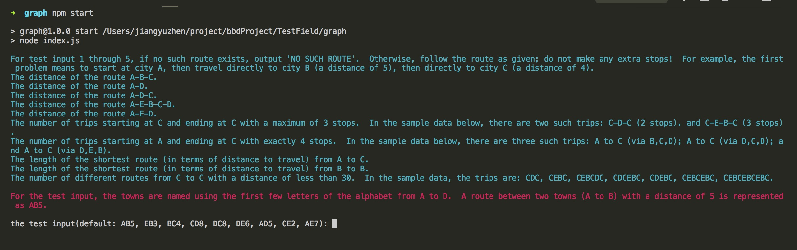
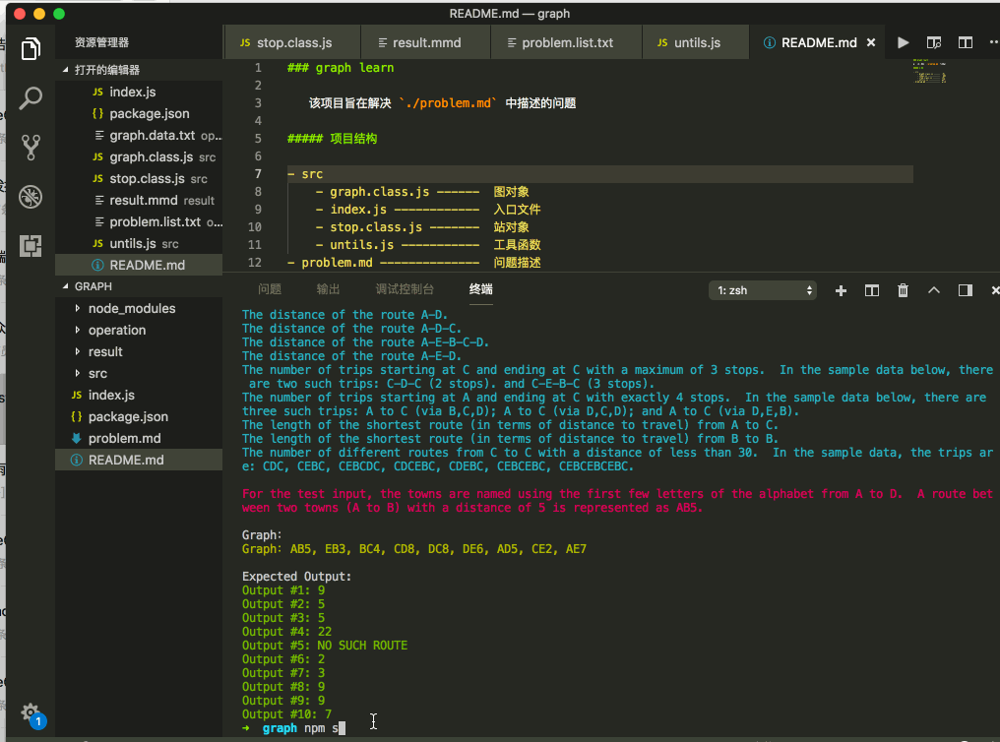

### graph learn

该项目旨在解决 `./problem.md` 中描述的问题

#### 项目结构
- operation
    - graph.data.text -----  默认 graph 数据，支持命令行输入 graph 数据
    - poblem.list.text ----  问题描述和待解决的问题
- src
    - graph.class.js ------  图对象
    - index.js ------------  入口文件
    - stop.class.js -------  站对象
    - untils.js -----------  工具函数
- problem.md --------------  问题描述

### 项目运行

1、命令行执行

```
npm start
```
2、当看到命令行出现如下图所示时，是提示你输入 graph 数据，默认读取 `./operation/graph.data.text` 的数据，所以你也可以通过更改 `./operation/graph.data.text`中的文本来输入 graph 数据。


```
提示：请按照正确的格式输入哦~
```

3. 结果就会直接在命令行中输出，如下图是整个过程：


